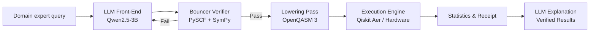

# ⚛️ QAC-L: Neuro-Symbolic Quantum AI Compiler

**The Problem:** LLMs hallucinate. Quantum physics requires exact precision. Pure LLM-to-circuit pipelines are reckless and unscientific.

**The Solution:** QAC-L is a neuro-symbolic compiler. We use a fine-tuned LLM strictly for natural-language intent capture, backed by a deterministic, formally verified classical layer (The Bouncer) that enforces physical bounds before any circuit is built.

QAC-L is a closed-loop, cloud-only AI-quantum pipeline that translates natural language into executable quantum circuits, runs them on simulators or real hardware, and reports verifiable results with a Quantum Execution Receipt.

## 🏛️ Architecture: Why Neuro-Symbolic?

Pure LLM pipelines fail because they lack formal verification. QAC-L bridges the abstraction gap by decoupling the probabilistic AI from the deterministic physics:

* **LLM Front-End (Intent Capture):** A fine-tuned Qwen2.5-3B model translates a domain expert's English query into a strict parametric specification (JSON/DSL). The LLM is physically incapable of writing gate-level code.
* **The Bouncer (Neuro-Symbolic Verification):** A deterministic validation layer using PySCF and SymPy. It enforces strict physical and numeric bounds before any circuit is built. If the LLM hallucinates an impossible parameter (e.g., a negative bond length), the Bouncer halts execution instantly.
* **Deterministic Compiler Core:** The verified spec is lowered to hardware-agnostic OpenQASM 3, then transpiled and executed via Qiskit/Aer.
* **Quantum Execution Receipt:** An anti-hallucination artifact. It provides cryptographic proof of the raw bitstring counts, exact backend, and shot count—proving the computation actually happened.



## 📊 Benchmarks & Capabilities

QAC-L has been verified across five quantum algorithms with **41 automated end-to-end checks passing with 0 failures**.

* **Grover Search:** Achieves 100% success probability on 4 items (N=4), closely tracking the theoretical optimum.
* **VQE Energy Accuracy:** Converged energy closely follows the analytical Morse-potential reference for H₂ across 0.5–2.5 Angstroms.
* **Hardware Agnostic:** Supports lowering to OpenQASM 3 for IBM, Quantinuum, and QuEra architectures.

### Feature Comparison

| Feature | QAC-L | PennyLane | Qiskit | Classiq |
| :--- | :---: | :---: | :---: | :---: |
| Natural-language input | ✅ | ❌ | ❌ | Partial |
| LLM-compiled DSL | ✅ | ❌ | ❌ | Partial |
| Anti-hallucination Bouncer | ✅ | ❌ | ❌ | ❌ |
| Quantum Execution Receipt | ✅ | ❌ | ❌ | ❌ |
| Cloud-only free deployment | ✅ | ✅ | ✅ | ❌ |

## 🚀 Quickstart

QAC-L runs entirely on free cloud infrastructure (HF Spaces CPU + Kaggle GPU for fine-tuning).

1. Clone the repository.
2. Install dependencies:
```bash
pip install -r requirements.txt
```

3. Run the Gradio UI:
```bash
python app.py
```

4. Open `http://127.0.0.1:7860` in your browser and try:
> *"Calculate the ground state energy of H2 at 1.2 Angstroms"*

## 🛠️ The Stack

* **LLM:** Qwen2.5-3B-Instruct (4-bit GGUF, fine-tuned via Unsloth/QLoRA)
* **Quantum Physics:** Qiskit, Qiskit Aer, PySCF, SymPy
* **Deployment:** Hugging Face Spaces (Gradio)
* **IR:** OpenQASM 3
